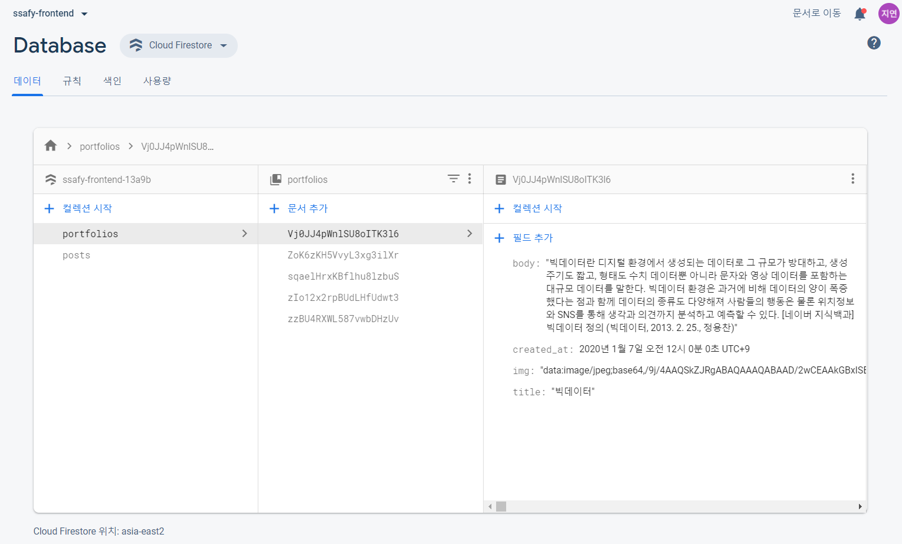
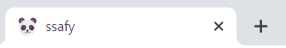
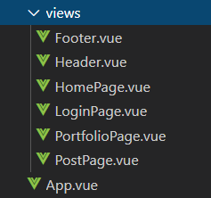

## [#1. Web/Mobile_웹기술 PJT : 웹 프론트엔드 / 백엔드 개발]

### [공통-Sub PJT I] 반응형 단일 페이지 애플리케이션 구현

#### 1. 소개

스켈레톤 프로젝트를 바탕으로 SPA의 기본 틀 구현 (Vue.js)

Firebase를 활용하여 Backend나 DB 구축 없이 프로젝트 진행


#### 2. 환경

- Node.js(NPM) - **12.14.1** (npm 6.13.6)

- Vue.js, Vue-cli, Firebase 패키지 설치

```
$ npm install
$ npm install -g yarn
$ npm install -g @vue/cli
$ npm install vue
$ npm install firebase-tools
$ npm list
```

- IDE: Visual Studio Code

- Firebase - 데이터베이스 이용

  

#### 3. 개발 구동 및 빌드 관련

##### 2020-01-13

- Req. 1. 스켈레톤 프로젝트 개발 환경 설정

  (Node.js 설치-npm사용, Vue.js, Vue-cli, Firebase 패키지 설치, 로컬로 실행)

  ```
  $ npm run serve
  ```

- Req. 2. Firebase 연동

  (스켈레톤 코드의 데이터 구조 파악 및 Firebase Database 구축 (Portfolio, Post))

  

- Req. 3. About Me 리사이징

  (반응형 웹 만들기 - 이미지 출력 설정, 텍스트 정렬)

  ```html
  <p class="mr-4 text-center text-sm-left" >
  <v-flex d-none d-sm-flex>
  ```

- Req. 4. Portfolio 리사이징

  (반응형 웹 만들기 - Portfolio/Post 그리드 변경 : 기본 12 / xs 모바일 / sm 태블릿 / lg 데스크탑) 
  
  ```html
  <v-flex v-for="i in portfolios.length > limits ? limits : portfolios.length" xs12 sm6 lg3 :key="i" >
  ```
  
  

##### 2020-01-14

- Req. 5. 이미지 배너 리사이징

  (반응형 웹 만들기 - 텍스트 사이즈 조절(v-resize-text) : https://www.npmjs.com/package/vue-resize-text)

  ```
  $ npm install vue-resize-text --save
  ```

  ```html
  <ImgBanner>
    <div class="text-center text-white" style="line-height:1.2em;" slot="text" v-resize-text>배너 텍스트</div>
  </ImgBanner>
  ```

  (반응형 웹 만들기 - 이미지 사이즈 조절)

  ```html
  <v-img :src="getImgUrl('2019-01-10-12-29-23.jpg')" aspect-ratio="2.5">
  ```

- Req. 6. 네비게이션 바

  (네비게이션 바 구현 - Router-link 연결)

  ```html
   <v-app-bar app>
        <span class="hidden-sm-and-up">
          <v-app-bar-nav-icon @click="sidebar = !sidebar">
              <v-icon>menu</v-icon>
          </v-app-bar-nav-icon>
        </span>
        <v-toolbar-title>
          <router-link to="/" tag="span" style="cursor: pointer">
            <strong>{{ appTitle }}</strong>
          </router-link>
        </v-toolbar-title>
        <v-spacer></v-spacer>
        <v-toolbar-items class="hidden-xs-only">
          <v-btn text v-for="item in menuItems" :key="item.title" :to="item.path">                   {{ item.title }}
          </v-btn>
        </v-toolbar-items>
      </v-app-bar>
  ```

- Req. 7. 모바일용 사이드 바

  (사이드 바 구현)

  ```html
  <v-navigation-drawer v-model="sidebar" fixed temporary>
        <v-list>
          <v-list-item v-for="item in menuItems" :key="item.title" :to="item.path">
            <v-list-item-action>           
            </v-list-item-action>
            <v-list-item-content>{{ item.title }}</v-list-item-content>
          </v-list-item>
        </v-list>
  </v-navigation-drawer>
  ```

- Req. 8. 커스터마이징

  (Favicon 변경)
  
  


##### 2020-01-15

- Req. 9. 구조 변경

  (네비게이션 바, 사이드 바 - Header/Footer 컴포넌트 분리)
  
  
  
  - App.vue
  
  ```html
  <template>
    <v-app>
      <Header></Header>
      <v-content>
        <router-view />
      </v-content>
      <Footer></Footer>
    </v-app>
  </template>
  ```
  
  (텍스트 줄 바꿈 설정)
  
  ```css
  <style scoped>
  .headline {
    display: inline-block;
    overflow: hidden;
    text-overflow: ellipsis;
    white-space: nowrap;  
  }
  .subheading {
    font-size: 12pt;
    /* 한 줄 자르기 */
    display: inline-block; 
    white-space: nowrap;
    overflow: hidden;
    text-overflow: ellipsis; 
    /* 여러 줄 자르기 추가 스타일 */
    white-space: normal;
    line-height: 1.2;
    height: 4.6em;
    text-align: left;
    word-wrap: break-word;
    display: -webkit-box;
    -webkit-line-clamp: 4;
    -webkit-box-orient: vertical;
  }
  </style>
  ```
  
  (커스터마이징 - 더보기 버튼 : 4개씩 limits 늘려주기)
  
  ```html
  <script>
  import Portfolio from "@/components/Portfolio";
  import FirebaseService from "@/services/FirebaseService";
  
  export default {
    name: "PortfoliosList",
    props: {
      limits: { type: Number, default: 4 },
      loadMore: { type: Boolean, default: false }
    },
    data() {
      return {
        portfolios: []
      };
    },
    components: {
      Portfolio
    },
    mounted() {
      this.getPortfolios();
    },
    methods: {
      async getPortfolios() {
        this.portfolios = await FirebaseService.getPortfolios();
      },
      loadMorePortfolios() {
        this.limits=this.limits+4;
      }
    }
  };
  </script>
  ```
  
  

##### 2020-01-16

- Req. 10. Frontend 배포

  (Firebase 호스팅 활용)

  ```
  $ npm run build 
  
  $ firebase init - 호스팅 설정
  
  $ firebase deploy
  ```

- Req. 11. 기능 테스트

  (테스트 케이스 작성 및 테스트)


##### 2020-01-17

- 프로젝트 평가 day

- 프로젝트 주제로 Frontend 수정

------


